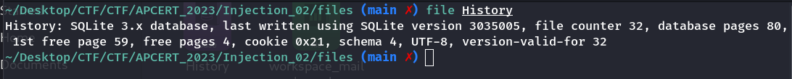
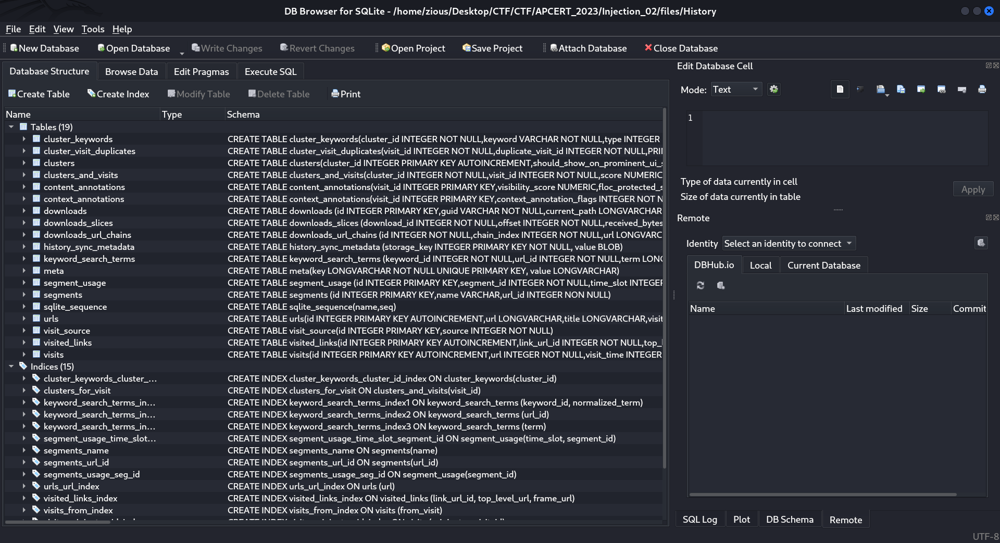
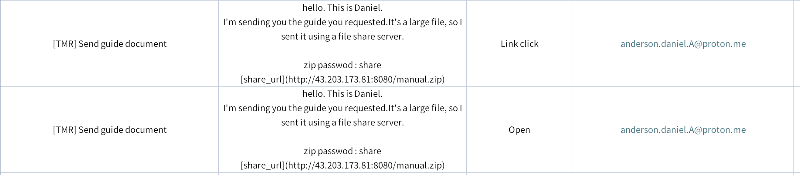
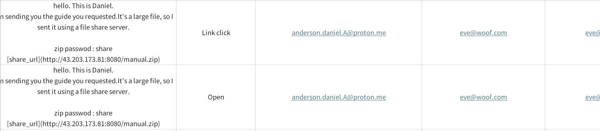
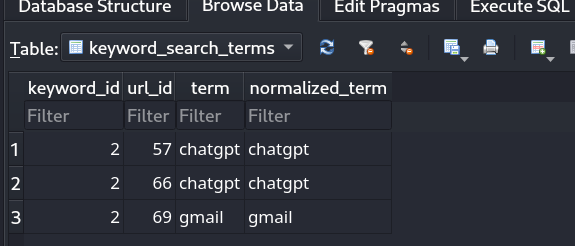
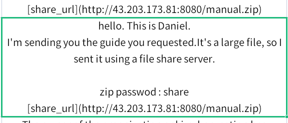
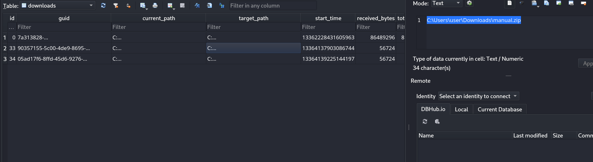

# **INJECT 02**

## Question 1

Hình thức tấn công xâm nhập (100)  
Kẻ tấn công đã dùng hình thức nào để tấn công, xâm nhập vào tổ chức? Lưu ý: Trả lời bằng số và chỉ được trả lời 1 lần.

1. Khai thác lỗ hổng phần mềm qua CVE
2. Khai thác lỗ hổng web
3. Bruteforce mật khẩu quản trị và khai thác lỗ hổng dịch vụ nội bộ
4. Phishing qua email
5. Tấn công tài khoản sa vủa MSSQL và thực hiện xp_cmdshell

## Answer 1

Trong Inject_02 chúng ta có 2 files: History và workspace_mail_logs.xlsx.

Định dạng file của file History chưa rõ nên cần dùng lệnh `file` để xem extensions file:

```
file History
```



Như vậy ta thấy được định dạng file là file Sqlite. Có thể sử dụng terminal hoặc Sqlite để xem nội dung file:



Quay lại file `workspace_mail_logs.xlsx`. Ta thấy là file chứa mail logs của công ty.

Kiểm tra hết các logs, ta thấy được các mail đều được gửi từ các tên miền đã được kiểm chứng như `google.com`, `woof.com`, `github.com`. Trong đó có một tên miền dịch vụ mail đáng ngờ là `proton.me`.  
`proton.me` là dịch vụ mail end-to-end encryption. Giúp che dấu đi ngừoi gửi thật sự. Như vậy dễ dàng thấy được mail đó đáng ngờ. Ngoài ra đây cũng là mail có nội dung tải file `.zip` và link tải tới một máy chủ không rõ bên ngoài và đã được click tải:



Qua các dữ kiện trên ta suy đoán được lần tấn công này được khai thác bằng hình thức email phishing.

> 4

## Question 2

Email của nạn nhân - người bị tấn công (100)  
Email của nạn nhân trong đợt tấn công lần này là?

## Answer 2



> eve@woof.com

## Question 3

Email của kẻ tấn công (100)  
Email của kẻ tấn công là gì?

## Answer 3

> anderson.daniel.A@proton.me

## Question 4

Tên tệp nghi ngờ là mã độc (100)  
Tên tệp tin được nghi ngờ là mã độc.

## Answer 4

> manual.zip

## Question 5

Nạn nhân đã tìm kiếm các thông tin gì? (100)  
Lựa chọn các mục sau:

1. ChatGPT
2. Proton
3. Gmail
4. Facebook
5. Github

## Answer 5

Trong nội dung file `History`. Ta thấy có một bảng là `keyword_search_terms`.  
Dữ liệu chứa trong bảng là các từ khóa đã được search bởi kẻ tấn công.



> 1, 3

## Question 6

Password của tệp nén (100)  
Trả lời password của tệp nén.

## Answer 6

Password giải nén tệp được lưu trong mail phising:



> share

## Question 7

Tên người dùng của máy tính nghi ngờ nhiễm mã độc (100)  
Trả lời tên người dùng của máy tính nghi ngờ nhiễm mã độc.

## Answer 7

Ta có thể tìm thấy tên người dùng của máy tính bị nhiễm mã độc ở trong file `History`.

Trong table `download`, ta thấy file mã độc được tải về và lưu trên máy với đường dẫn:

```
C:\Users\user\Downloads\manual.zip
```



Ta thấy được tên người dùng là `user`

> user
